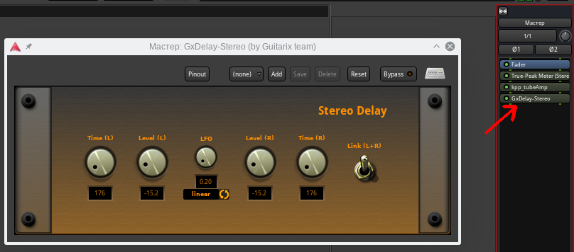
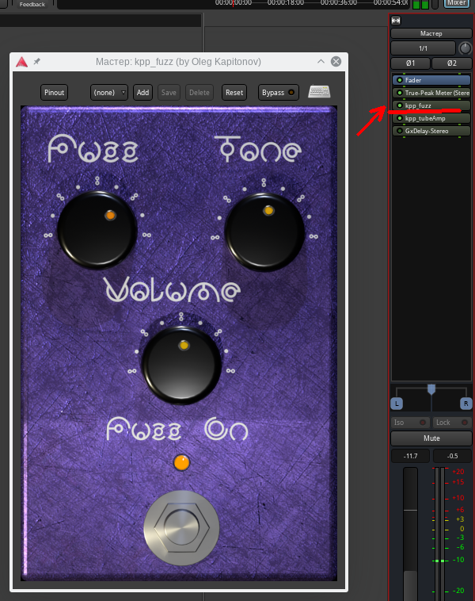
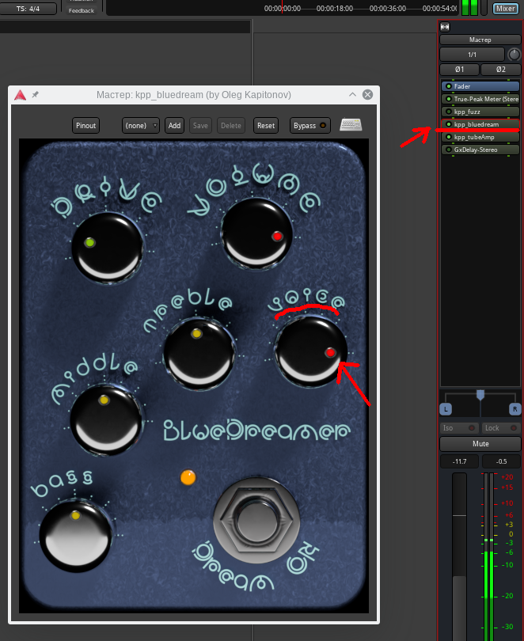
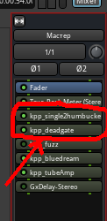
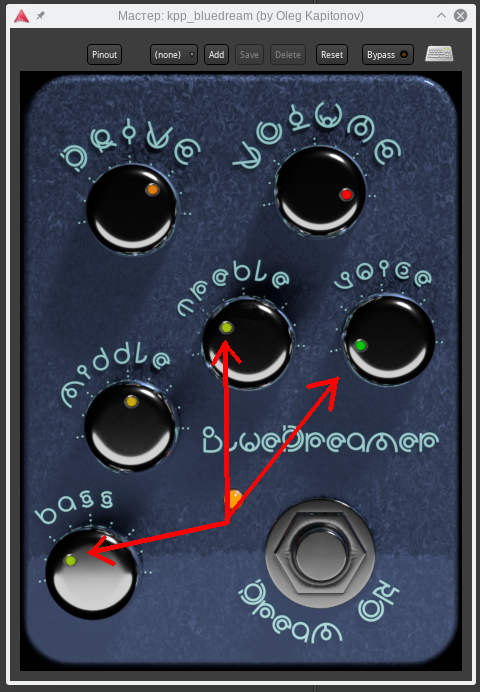

Quick start
===========

We will use LV2 versions of plugins.

### 1. Start Ardour. Create a new empty session.

Configure the session settings as shown.
Note the Sample rate and Buffer size parameters.
Sample rate can be any value, 96 kHz is recommended.
If the load on your processor is too high, select
48 kHz. I recommend using 48 kHz or 96 kHz for best quality
(to avoid lossy IR resampling). 44.1 kHz will work good (but not best).

Buffer size - lower value gives lower latency.
Find the lowest working value.
The tubeAmp plugin has a limit. Buffer size must be at least 64.

### 2. A very important step is to adjust the signal level.

To measure the level, you can use True-Peak Meter plugin
by Robin Gareus from the meters.lv2 set, or similar.

Maximum signal level when you hit all the strings
should be at -20 dB. Use the Fader to adjust
level.

### 3. Everything is ready, now let's start playing.

Add the kpp_tubeamp plugin.
Turn the knobs, adjust the sound. Default profile
designed for "clean" sound. On the bottom line there are additional
settings. 

Level is output level slider.
Unlike the Drive and Volume knobs this slider does not affect crunch and
tone. It only changes the volume. Cabinet % allows you to smoothly
disable cabinet emulation.

To select profile click it name and select *.tapf file in the dialog.
If dialog does not appear, install Zenity application!

### 4. Use other guitar plugins.

For example, add after
tubeAmp GxDelay plugin by Guitarix Team.

### 5. Let's add pedal emulators! Start with kpp_fuzz plugin.

Add it before tubeAmp as shown. Adjust the knobs,
try different sounds.

Change your profile to British Crunch. Compare how it sounds with Fuzz.

### 6. Now let's try the Overdrive pedal.

Make sure you have British Crunch profile in tubeAmp.
Add the kpp_bluedream plugin. Install the knobs as shown.

In this position, Voice knob works as Booster. Knobs
Bass, Middle, Treble can be used as an equalizer.

In this position, Voice knob works as Tube Screamer.
The settings are suitable for classic Hard Rock.

### 7. It's time to play Heavy Metal!

If you have a Stratocaster guitar with single coil pickups - no problem.
Add kpp_single2humbucker plugin and kpp_deadgate plugin. Example settings
are shown.

If you have a guitar with humbucker pickups, chances are you don't need these two plug-ins.

Select British Crunch profile for tubeAmp, leave kpp_bluedream in front of it.
Adjust the knobs as shown.

### 8. Let's try the Distortion effect.

Change your profile to American Clean and add the kpp_distruction plugin.
This plugin is designed to work in a "clean" channel, so in tubeAmp
the Clean profile must be selected.

The plugin has not much gain. To make the sound heavier, place 
kpp_bluedream in front of it. Example of settings in the picture.

### 9. Now we will get a really heavy sound.

Select Modern Metal profile in tubeAmp. The profile is based on the 
sound of famous amplifiers Triple Rectifier. It has
a lot of bass. Place kpp_bluedreamer in front of him.

The first option - "warm" sound.

The second option - "dry", sharp sound.

That's it! Experiment freely and do not use
more gain than you really need!
