Быстрый старт
=============

Мы будем использовать LV2 версии плагинов.

### 1. Запустите Ardour. Создайте новую пустую сессию.

Настройте параметры сессии, как показано на рисунке.
Обратите внимание на параметры Sample rate и Buffer size.
Sample rate может быть любой, рекомендуется 96 кГц.
Если нагрузка на ваш процессор слишком высока, установите
48 кГц. Рекомендуется использовать 48 кГц или 96 кГц для
максимального качества, при этом не будет потерь на ресемплинг
импульсов в *.tapf файлах. 44.1 кГц тоже будет работать хорошо,
но не с максимальным качеством.

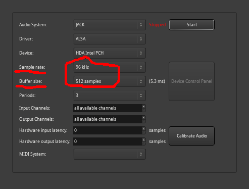

Buffer size - чем меньше значение, тем меньше задержка.
Найдите наименьшее рабочее значение путем подбора.
У плагина tubeAmp есть ограничение - Buffer size должен быть не менее 64.

### 2. Очень важный этап - настройка уровня сигнала.

Для измерения уровня вы можете использовать плагин True-Peak Meter
от Robin Gareus из набора meters.lv2, или аналогичный.

Максимальный уровень сигнала, когда вы бьете по всем струнам,
должен быть на уровне -20 dB. Используйте Fader, чтобы настроить
уровень на эту величину.

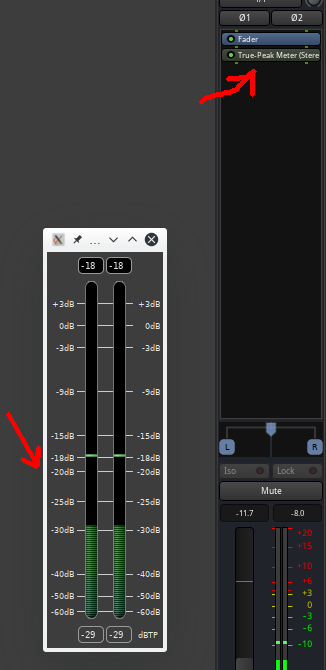

### 3. Все готово, теперь начнем играть.

Добавьте плагин kpp_tubeamp. Появится его GUI.
Покрутите ручки, настройте звучание. Профиль по умолчанию
рассчитан на "чистый" звук. На нижней полосе есть дополнительные
настройки. 

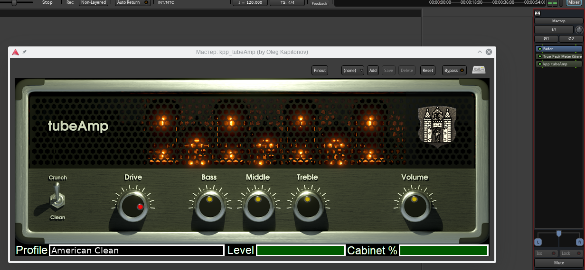

Level - уровень выходного сигнала,
в отличие от ручек Drive и Volume не влияет на степень перегруза и
звучание, только меняет громкость. Cabinet % - позволяет плавно
убрать эмуляцию кабинета.

Выбор профиля - щелкните по нему и выберите в диалоге
файл профиля формата *.tapf. 
Если диалог не появляется, установите программу Zenity!

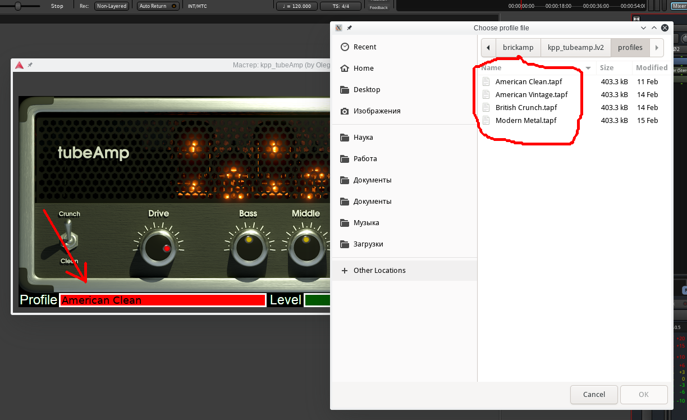

### 4. Используйте другие гитарные плагины.

Например, добавьте после
tubeAmp плагин GxDelay от Guitarix Team.

### 5. Добавим эмуляторы педалей! Начнем с плагина kpp_fuzz.

Добавьте его перед tubeAmp, как на рисунке. Покрутите ручки,
попробуйте разное звучание.

Смените профиль на British Crunch. Сравните, как Fuzz звучит с
этим профилем.

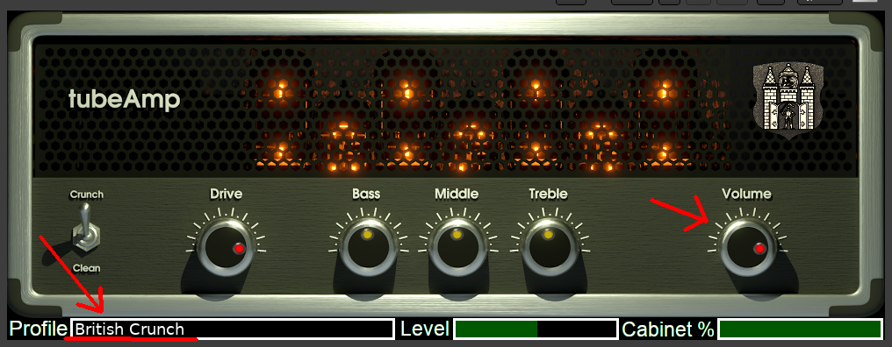

### 6. Теперь попробуем педаль Overdrive.

Убедитесь, что в tubeAmp у вас профиль British Crunch.
Добавьте плагин kpp_bluedream. Установите ручки, как показано на
рисунке.

В таком положении ручки Voice плагин работает как Booster. Ручки
Bass, Middle, Treble можно использовать как эквалайзер.

В таком положении ручки Voice плагин работает как Tube Screamer.
Настройки подходят для классического Hard Rock.

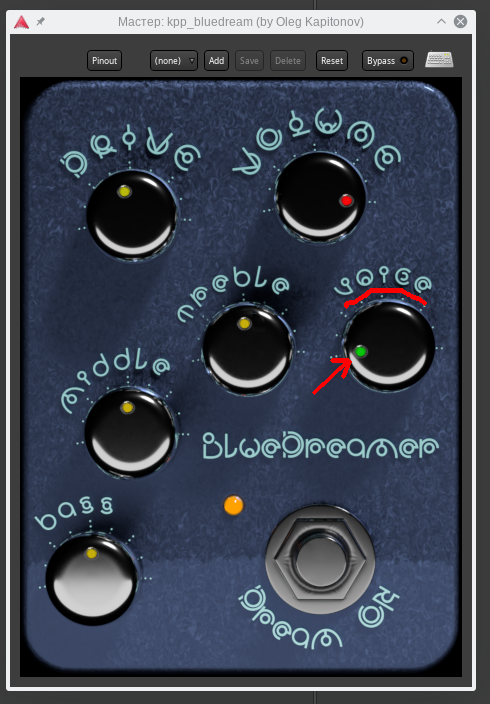

### 7. Пришло время поиграть Heavy Metal!

Если у вас гитара Stratocaster с датчиками Single Coil - не проблема.
Добавьте плагин kpp_single2humbacker и плагин kpp_deadgate. Пример настроек
на рисунке.

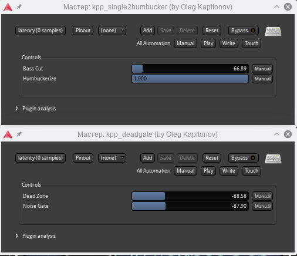

Если у вас гитара с датчиками Humbucker, скорее всего вам не нужны эти два пагина.

Профиль для tubeAmp - British Crunch, оставьте kpp_bluedream перед ним.
Настройте ручки как на рисунке.

### 8. Попробуем эффект Distortion.

Смените профиль на American Clean и добавьте плагин kpp_distruction.
Этот плагин рассчитан на работу в "чистый" канал, поэтому в tubeAmp
должен быть выбран именно Clean профиль.

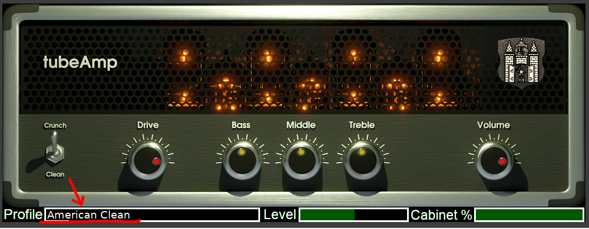

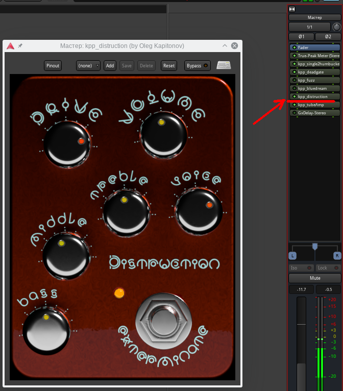

Плагин имеет не так много гейна. Чтобы утяжелить звучание, включите
перед ним kpp_bluedream. Пример настроек на рисунке.

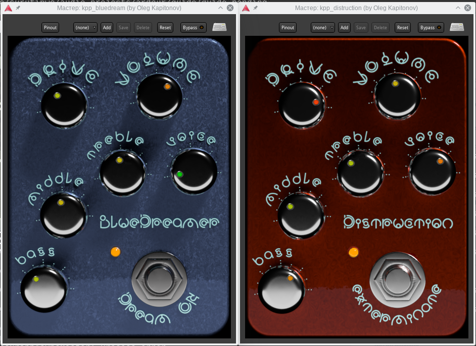

### 9. Теперь получим по настоящему тяжелый звук.

Выберите профиль Modern Metal в tubeAmp. Профиль ориентирован по свойствам
и звучанию на знаменитые усилители Triple Rectifier. Он пропускает
очень много баса на вход. Включите перед ним kpp_bluedreamer.

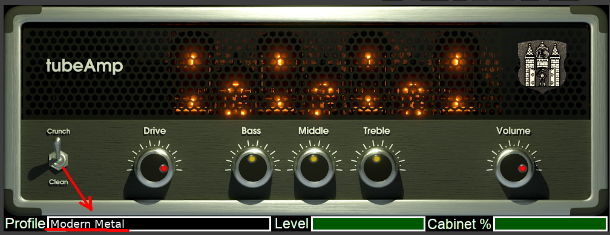

Примеры на рисунках. Первый вариант - "жирное" звучание.

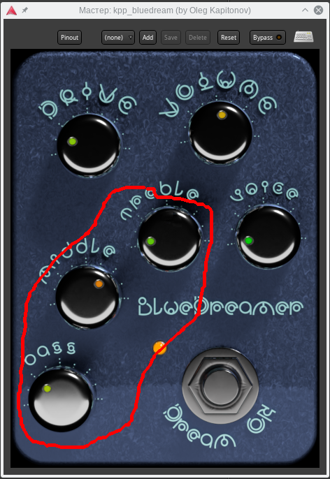

Второй вариант - "сухое", более резкое звучание.

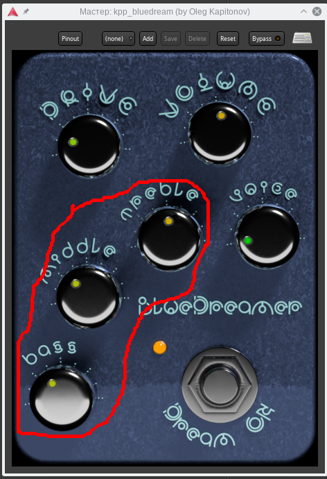

На этом все! Экспериментируйте свободно, и главное - при любых
настройках не злоупотребляйте величиной гейна!

