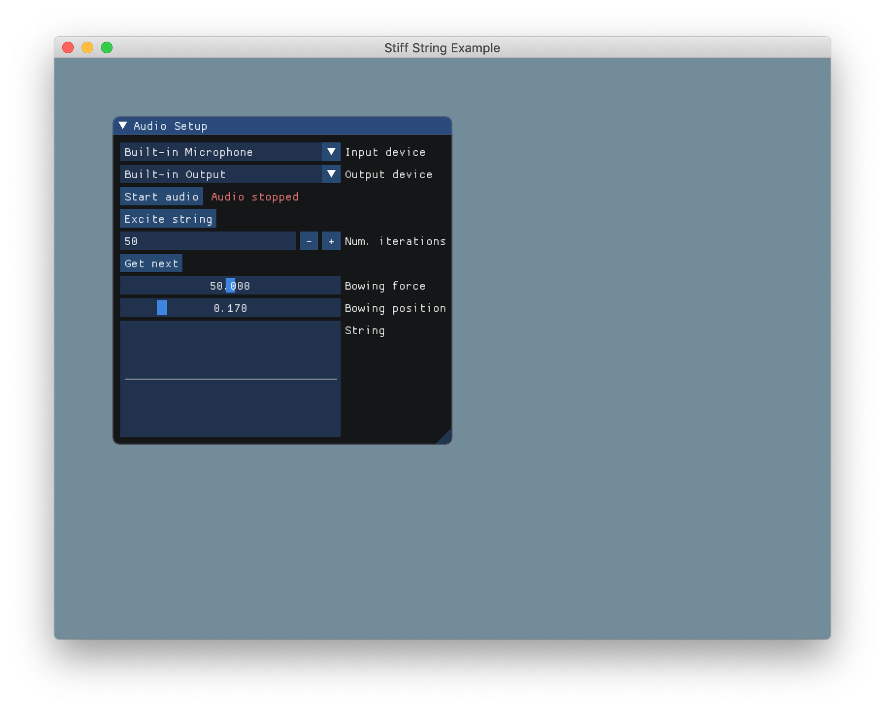

# Physical Model for Sound Synthesis of a Stiff String in C++



This repository contains an example C++ implementation of a bowed and otherwise
excited stiff string, modeled using finite difference methods.

See [1] for more info about physical modeling using finite difference methods.

[1] S. Bilbao, Numerical Sound Synthesis. Chichester, UK: John Wiley & Sons, Ltd, 2009.


## Building

Before building, make sure that you have [all the dependencies needed to build 
*pal* projects](https://github.com/PelleJuul/pal).

Once dependencies are installed, you can build the application with

```
$ make
```

and run it with

```
$ make run
```